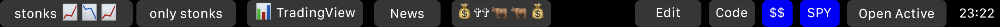

# MTMR-TradingBar

> William Kwok

MTMR-TradingBar is a locally hosted server aimed to provide special functionality to the [MTMR touchbar application](https://github.com/Toxblh/MTMR) to view live stock tickers, news, and user friendly config changing.

This is currently a work in progress, and will only be used by me and a few friends. User friendly installation is currently not on the roadmap for this project. 

# To setup

1. Clone the repository
2. You will need to install [MTMR](https://github.com/Toxblh/MTMR) and NPM, and ideally use the version specified within .nvmrc.
3. Modify `config/config.jsonc` with the correct information. You should only have to change `MTMR_CODE` at the time of typing this, if you want to set up the code button to open the repo in Visual Studio Code.
4. `cd` into `touchbarserver` and do `npm install`.
5. Go back to the repo base and do `./scripts/run_touchbar_server.sh`. Everything should work. 

# About

MTMR Tradingbar will turn your touchbar into a rich interactive touchbar with stock data. Brightness and sound dials are hidden, but you can double finger swipe or triple finger swipe for sound and brightness respectively.

## Keep track of your favorite stocks

The backend of MTMR Tradingbar polls Yahoo finance every 750 ms for the latest stock data. (DEV NOTE: We are working on converting this to Alpaca Websocket API instead to conserve data). You'll be able to see live pre-market, market, and post-market data! Long hold a stock to open up its page on Robinhood.

Futures are up, what can we say?

## Explore your favorite stock

Ever wanted to get in depth information for your favorite stock, Tesla? Once you open the menu, you can choose to open it on Robinhood, look at Barchart for options volume information, or even compare it to SPY for the past 2 days. 

Finally, you can check out the news for the stock.

Our news endpoint grabs data from Google news RSS feed, and lets you read the latest headlines for any stock. Scroll through all the top headlines and when one interests you, click on it and immediately be directed to the news site. Long press to copy a link to it.
